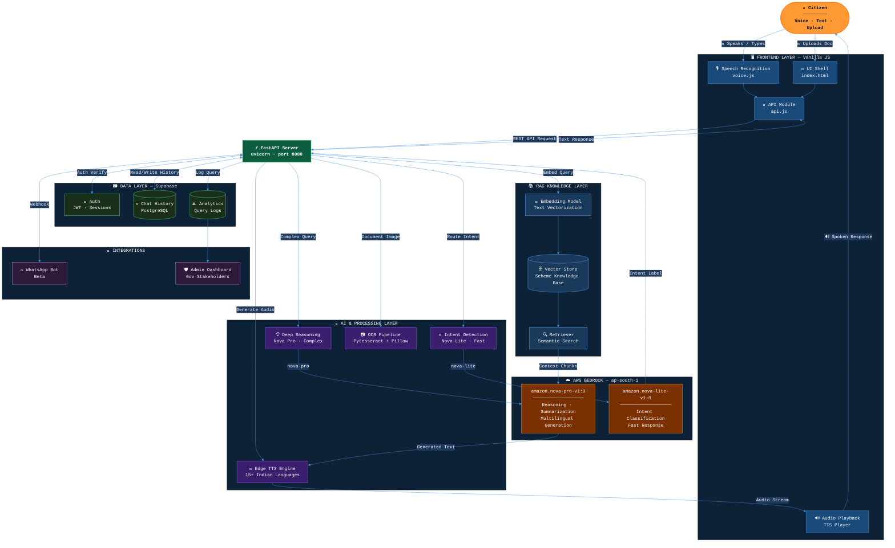
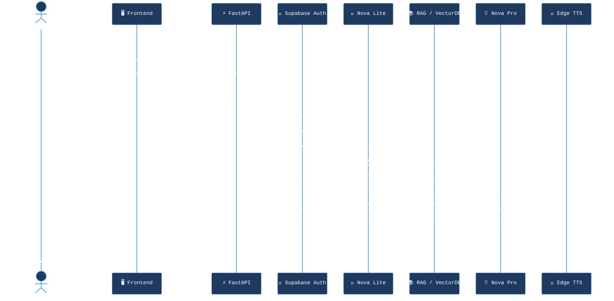
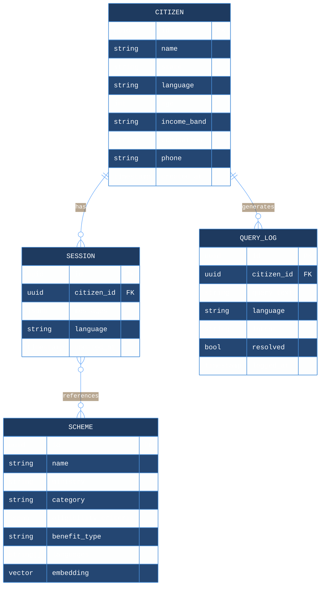
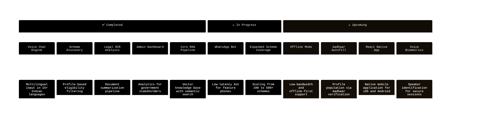

<div align="center">

<!-- Header Banner -->


<br/>

### 🇮🇳 *Bridging the Last Mile — Government Services in Every Voice*

<br/>

<!-- Primary Action Badges -->
<p align="center">
  <a href="https://saarthi-ai-frontend.vercel.app">
    
  </a>
  &nbsp;
  <a href="https://your-demo-link.com">
    
  </a>
  &nbsp;
  
</p>

<br/>

<!-- Tech Stack Row 1 -->
<p align="center">
  
  
  
  
  
</p>

<!-- Tech Stack Row 2 -->
<p align="center">
  
  
  
  
  
</p>

<!-- Repo Stats -->
<p align="center">
  
  
  
  
  
</p>

<br/>

> **Saarthi AI** is an AI-powered, voice-first assistant that makes India's **100+ government schemes** and **legal services** accessible to every citizen — in their own language, on any device, regardless of literacy.

</div>

---

## 📌 Table of Contents

| # | Section |
|---|---------|
| 1 | [🔴 The Problem](#-the-problem) |
| 2 | [✅ Our Solution](#-our-solution) |
| 3 | [🏗️ System Architecture](#%EF%B8%8F-system-architecture) |
| 4 | [🔄 Request Lifecycle](#-request-lifecycle) |
| 5 | [🗺️ Data Model](#%EF%B8%8F-data-model) |
| 6 | [✨ Core Features](#-core-features) |
| 7 | [🛠️ Tech Stack](#%EF%B8%8F-tech-stack) |
| 8 | [📂 Project Structure](#-project-structure) |
| 9 | [🚀 Getting Started](#-getting-started) |
| 10 | [🗺️ Roadmap](#%EF%B8%8F-roadmap) |
| 11 | [🤝 Contributing](#-contributing) |
| 12 | [📜 License](#-license) |

---

## 🔴 The Problem

India's digital transformation has accelerated — yet millions of citizens remain cut off from the services they deserve. The barriers are structural:

```
┌─────────────────────────────────────────────────────────────────┐
│  780M+  internet users in India — yet access ≠ understanding   │
└─────────────────────────────────────────────────────────────────┘
```

| ⚠️ Barrier | 💥 Impact |
|---|---|
| 🌐 **Language Diversity** | Portals are in English/Hindi — 600M+ regional speakers left behind |
| 📖 **Literacy Gap** | Dense legal jargon blocks eligible citizens from claiming benefits |
| 📵 **UX Inaccessibility** | Interfaces designed for tech-savvy users, not first-time users |
| 🧭 **Scheme Complexity** | 100+ schemes with different eligibility criteria — impossible to navigate alone |

> The result: eligible citizens miss welfare, subsidies, and legal protections — not because the schemes don't exist, but because the **system is not designed for them.**

---

## ✅ Our Solution

Saarthi AI is a **multilingual, voice-first AI companion** that removes every barrier between a citizen and their rights:

<div align="center">

| 🗣️ Speak | 🔍 Discover | 📄 Understand | 🎧 Hear Back |
|---|---|---|---|
| Ask in any Indian language — spoken or typed | Find schemes matching your exact profile | Upload documents, get plain-language summaries | Responses in natural, regional-accent audio |

</div>

**Saarthi removes the intermediary** — no middlemen, no confusion, no exclusion.

---

## 🏗️ System Architecture

> End-to-end view of how Saarthi AI processes a citizen's request — from voice input to spoken response.



---

## 🔄 Request Lifecycle

> How a single voice query flows through the system — from speech to spoken response.



---

## 🗺️ Data Model

> Core entities powering Saarthi's personalized scheme recommendations.



---

## ✨ Core Features

### 🤖 Conversational AI — AWS Bedrock


- **Dual-model strategy**: `nova-pro-v1:0` for deep multi-step reasoning; `nova-lite-v1:0` for sub-100ms intent classification
- **Persistent memory**: Full conversation history in Supabase — multi-turn, stateful sessions
- **Profile-aware personalization**: Responses adapt to citizen's **State**, **Income**, **Age**, and **Occupation**

---

### 🎙️ Voice & Multilingual Engine


- Supports **15+ Indian languages** with natural prosody via **Microsoft Edge TTS**
- Regional accents built for trust — the AI sounds like it belongs to the community it serves
- Designed for first-time internet users who are more comfortable speaking than typing

---

### 📄 Legal Document Analysis


- Upload any government notice, legal letter, or scanned PDF
- **Pytesseract + Pillow** pipeline delivers high-accuracy text extraction
- Nova Pro summarizes output in plain language — highlighting **key rights**, **deadlines**, and **required actions**

---

### 📊 Admin & Analytics Dashboard


| Metric | Description |
|---|---|
| 🔥 **Trending Queries** | Most searched schemes and questions in real time |
| 🗺️ **Language Map** | Active languages and regions, visualized by volume |
| ❌ **Failed Queries** | Unresolved questions — signals where the knowledge base needs expansion |
| 📈 **Engagement Trends** | Daily/weekly active users by state and language |

---

### 📱 WhatsApp Integration *(Beta)*


A low-latency WhatsApp bot for citizens without high-speed internet or smartphone access — Saarthi meeting citizens exactly where they are.

---

## 🛠️ Tech Stack

<div align="center">

| Layer | Technology | Purpose |
|---|---|---|
|  | **Python 3.10+** | Core backend runtime |
|  | **FastAPI + Uvicorn** | Async REST API server |
|  | **Nova Pro & Nova Lite** | LLM inference and intent detection |
|  | **Supabase PostgreSQL** | Auth, sessions, analytics |
|  | **Custom Vector Store** | RAG knowledge retrieval |
|  | **Microsoft Edge TTS** | Multilingual voice synthesis |
|  | **Pytesseract + Pillow** | Document OCR pipeline |
|  | **HTML5 / CSS3 / JS** | Zero-dependency frontend |
|  | **Vercel** | Frontend deployment |

</div>

---

## 📂 Project Structure

```bash
Saarthi_AI/
│
├── 📁 Backend/                         # Python / FastAPI Core
│   ├── 🐍 main.py                      # Application entry point
│   │
│   ├── 📁 routes/                      # API route handlers (v1)
│   │   ├── 🔐 auth.py                  # JWT authentication & user management
│   │   ├── 🤖 ai.py                    # Chat, voice synthesis, OCR endpoints
│   │   ├── 📋 schemes.py               # Scheme discovery & eligibility filtering
│   │   └── 📊 admin.py                 # Analytics & admin dashboard endpoints
│   │
│   ├── 📁 core/                        # Shared infrastructure clients
│   │   ├── ☁️  bedrock_client.py        # AWS Bedrock connection & model calls
│   │   └── 🗄️  supabase_client.py       # Supabase connection & query helpers
│   │
│   ├── 📁 rag/                         # Retrieval-Augmented Generation
│   │   └── 📚 knowledge_base/          # Indexed scheme documents & embeddings
│   │
│   └── 📁 seed/
│       └── 🌱 schemes_data.py          # Initial scheme data & seeding scripts
│
├── 📁 Frontend/                        # Static HTML / CSS / JS Interface
│   ├── 🌐 index.html                   # Application shell
│   │
│   ├── 📁 JS/
│   │   ├── 🎙️  voice.js                # Speech recognition & TTS audio playback
│   │   ├── 🔌 api.js                   # Backend API communication layer
│   │   └── 🎨 ui.js                    # UI state management & event handlers
│   │
│   └── 📁 CSS/
│       └── 🎨 styles.css               # Responsive design system & tokens
│
├── 📄 .env.example                     # Environment variable template (safe to commit)
├── 📄 requirements.txt                 # Python dependencies
└── 📄 README.md
```

---

## 🚀 Getting Started

### Prerequisites


---

### Step 1 — Clone the Repository

```bash
git clone https://github.com/yourusername/Saarthi_AI.git
cd Saarthi_AI/Backend
```

### Step 2 — Create & Activate Virtual Environment

```bash
python -m venv venv

# macOS / Linux
source venv/bin/activate

# Windows (PowerShell)
.\venv\Scripts\Activate.ps1
```

### Step 3 — Install Dependencies

```bash
pip install -r requirements.txt
```

### Step 4 — Configure Environment Variables

```bash
cp .env.example .env
```

```env
# ── Server ──────────────────────────────────────────────
PORT=8080

# ── AWS Credentials ─────────────────────────────────────
AWS_ACCESS_KEY_ID=your_access_key_id
AWS_SECRET_ACCESS_KEY=your_secret_access_key
AWS_REGION=ap-south-1
BEDROCK_REGION=us-east-1

# ── Supabase ─────────────────────────────────────────────
SUPABASE_URL=https://your-project.supabase.co
SUPABASE_KEY=your_supabase_anon_key
```

> ⚠️ **Security**: Never commit your `.env` file. It is excluded via `.gitignore` by default.

### Step 5 — Start the Development Server

```bash
uvicorn main:app --reload --port 8080
```

| Endpoint | URL |
|---|---|
| 🔌 API Base | `http://localhost:8080` |
| 📖 Swagger Docs | `http://localhost:8080/docs` |
| 📘 ReDoc | `http://localhost:8080/redoc` |

### Frontend Setup

```bash
cd Frontend
npx serve .          # or just open index.html directly
```

---

## 🗺️ Roadmap



---

## 🤝 Contributing

We are **building for a billion voices** — contributions are welcome and encouraged.


| Area | Description |
|---|---|
| 🌍 **Localized Datasets** | Scheme data and translations in regional languages |
| 🎙️ **Voice Models** | Improved accents and prosody for underrepresented languages |
| ♿ **UI Accessibility** | Enhancements for users with disabilities or low digital literacy |
| 🧪 **Test Coverage** | Unit and integration tests for API routes and AI pipelines |

```bash
# Fork → Branch → Commit → PR
git checkout -b feature/your-feature-name
git commit -m "feat: add Malayalam TTS support"
git push origin feature/your-feature-name
```

> Follow [Conventional Commits](https://www.conventionalcommits.org/): `feat:`, `fix:`, `docs:`, `chore:` prefixes required.

---

## 📜 License

This project is licensed under the **MIT License** — see the [LICENSE](./LICENSE) file for details.

---

<div align="center">


**Built with purpose, for every citizen of India** 🇮🇳

*If Saarthi helped you or inspired your work, consider giving it a* ⭐

<br/>


</div>
