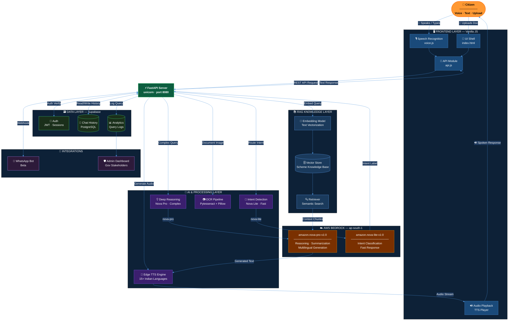
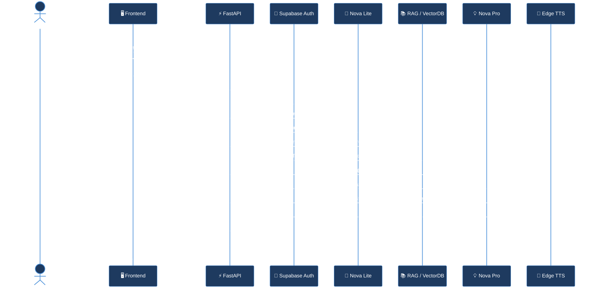
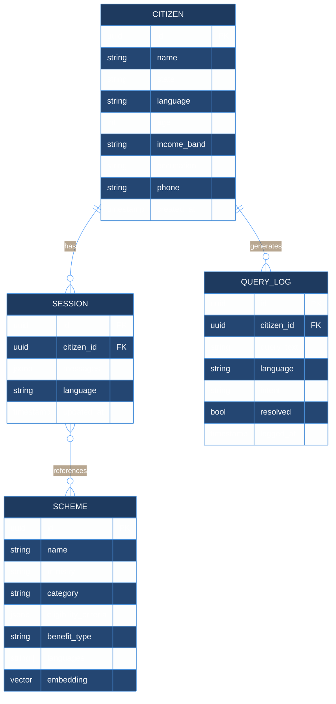
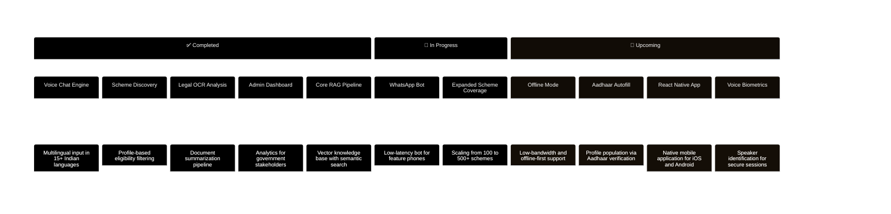

<div align="center">

<!-- Header Banner -->


<br/>

### 🇮🇳 *Bridging the Last Mile — Government Services in Every Voice*

<br/>

<!-- Primary Action Badges -->
<p align="center">
  <a href="https://saarthi-ai-frontend.vercel.app">
    
  </a>
  &nbsp;
  <a href="https://your-demo-link.com">
    
  </a>
  &nbsp;
  
</p>

<br/>

<!-- Tech Stack Row 1 -->
<p align="center">
  
  
  
  
  
</p>

<!-- Tech Stack Row 2 -->
<p align="center">
  
  
  
  
  
</p>

<!-- Repo Stats -->
<p align="center">
  
  
  
  
  
</p>

<br/>

> **Saarthi AI** is an AI-powered, voice-first full-stack platform that makes India's **100+ government schemes** and **legal services** accessible to every citizen — in their own language, on any device, regardless of literacy level.

<br/>

</div>

---

## 📌 Table of Contents

| # | Section |
|---|---------|
| 1 | [🔴 The Problem](#-the-problem) |
| 2 | [✅ Our Solution](#-our-solution) |
| 3 | [✨ Core Features](#-core-features) |
| 4 | [🏗️ System Architecture](#%EF%B8%8F-system-architecture) |
| 5 | [🔄 Request Lifecycle](#-request-lifecycle) |
| 6 | [🗺️ Data Model](#%EF%B8%8F-data-model) |
| 7 | [🛠️ Tech Stack](#%EF%B8%8F-tech-stack) |
| 8 | [📂 Project Structure](#-project-structure) |
| 9 | [🚀 Getting Started](#-getting-started) |
| 10 | [🌐 Environment Variables](#-environment-variables) |
| 11 | [📡 API Endpoints](#-api-endpoints) |
| 12 | [🗺️ Roadmap](#%EF%B8%8F-roadmap) |
| 13 | [🤝 Contributing](#-contributing) |
| 14 | [📜 License](#-license) |

---

## 🔴 The Problem

India's digital transformation has accelerated — yet **millions of citizens remain cut off** from services they legally deserve. The barriers are structural and systemic:

```
┌─────────────────────────────────────────────────────────────────────────┐
│   780M+ internet users in India — yet access ≠ understanding            │
│   600M+ regional-language speakers — yet portals are in English/Hindi   │
│   100+ government welfare schemes — yet most go undiscovered            │
└─────────────────────────────────────────────────────────────────────────┘
```

| ⚠️ Barrier | 💥 Real-World Impact |
|---|---|
| 🌐 **Language Diversity** | Portals are in English/Hindi — 600M+ regional speakers are effectively excluded |
| 📖 **Literacy Gap** | Dense legal jargon blocks eligible citizens from understanding and claiming benefits |
| 📵 **UX Inaccessibility** | Interfaces designed for tech-savvy users, not first-time or low-literacy users |
| 🧭 **Scheme Complexity** | 100+ welfare schemes with different eligibility criteria — impossible to navigate alone |
| 🏛️ **Middlemen & Corruption** | Eligible citizens exploited by intermediaries who charge fees for "assistance" |

> **The result:** Eligible citizens miss welfare, subsidies, and legal protections — not because the schemes don't exist, but because **the system was never designed for them.**

---

## ✅ Our Solution

Saarthi AI is a **multilingual, voice-first AI companion** that removes every barrier between a citizen and their rights — with zero intermediaries.

<div align="center">

| 🗣️ Speak | 🔍 Discover | 📄 Understand | 🎧 Hear Back |
|---|---|---|---|
| Ask in any Indian language — spoken or typed | Find schemes matching your exact profile | Upload documents, get plain-language summaries | Responses in natural, regional-accent audio |

</div>

**Saarthi removes the intermediary.** No middlemen. No confusion. No exclusion. Just a citizen and their rights.

---

## ✨ Core Features

### 🤖 Conversational AI — AWS Bedrock


Saarthi uses a **dual-model AI strategy** built on AWS Bedrock in the `ap-south-1` region:

- **`amazon.nova-pro-v1:0`** — Deep multi-step reasoning, complex Q&A, document summarization, and multilingual response generation
- **`amazon.nova-lite-v1:0`** — Sub-100ms intent classification and routing (scheme discovery, legal query, document analysis, general chat)
- **Persistent multi-turn memory** — Full conversation history stored in Supabase PostgreSQL for stateful, contextual sessions
- **Profile-aware personalization** — Responses dynamically adapt to citizen's State, Income Band, Age, and Occupation

---

### 🎙️ Voice & Multilingual Engine

Powered by **Microsoft Edge TTS**, Saarthi speaks India's languages with natural prosody and regional accents:


**15+ Indian languages** supported with regional accents built for community trust. Designed for first-time internet users more comfortable speaking than typing.

**Voice Pipeline:**
1. **Speech-to-Text** — Browser Web Speech API captures voice input in real-time
2. **Text Transmission** — Transcribed text sent to FastAPI backend with language code
3. **AI Processing** — Nova Pro generates response in the user's native language
4. **Text-to-Speech** — Edge TTS synthesizes natural audio (e.g., `mr-IN-AarohiNeural` for Marathi)
5. **Audio Playback** — Streamed `.mp3` played back directly in the browser UI

---

### 📚 RAG-Powered Scheme Discovery

Saarthi's knowledge base uses **Retrieval-Augmented Generation (RAG)** to deliver precise, contextual answers about government schemes:

- **Vector Embeddings** — All scheme documents are embedded and stored in a custom vector store
- **Semantic Search** — User queries are embedded and matched against the knowledge base using cosine similarity
- **Context Injection** — Top-3 relevant scheme chunks injected into the Nova Pro prompt for grounded, hallucination-resistant answers
- **Profile Filtering** — Eligibility criteria (state, income, age, occupation) pre-filter retrieved chunks before LLM reasoning

**Supported Scheme Categories:**
- Agriculture & Farmer Welfare (PM-KISAN, Fasal Bima)
- Women & Child Development (Sukanya Samriddhi, Ujjwala)
- Housing & Urban Development (PMAY)
- Education & Scholarships
- Healthcare (Ayushman Bharat)
- Employment & Skill Development (MGNREGS)
- Social Security & Pension

---

### 📄 Legal Document Analysis


Citizens can upload any government document and receive a plain-language summary:

- Upload government notices, legal letters, court summons, or scanned PDFs
- **Pytesseract + Pillow** pipeline performs high-accuracy OCR on images and scanned documents
- **Nova Pro** analyzes extracted text and summarizes in the citizen's chosen language
- Output highlights **key rights**, **deadlines**, **required actions**, and **legal implications**
- Works with handwritten forms, official stamps, blurry scans — not just clean digital PDFs

---

### 📊 Admin & Analytics Dashboard


Built for government stakeholders and programme managers to understand citizen needs at scale:

| Metric | Description |
|---|---|
| 🔥 **Trending Queries** | Most searched schemes and questions in real time — showing which schemes citizens are most confused about |
| 🗺️ **Language Distribution Map** | Active languages and query volumes visualized by region |
| ❌ **Failed/Unresolved Queries** | Queries where Saarthi couldn't find an answer — signals knowledge base gaps |
| 📈 **Engagement Trends** | Daily/weekly active citizens segmented by state, language, and scheme category |
| 👥 **User Demographics** | Anonymized income band, occupation, and age distribution of active users |

All analytics powered by Supabase's real-time PostgreSQL, accessible via the protected `/admin` route.

---

### 💬 WhatsApp Integration *(Beta)*


A low-latency WhatsApp bot for citizens without smartphone access or high-speed internet:

- **Webhook-based** — FastAPI receives and processes WhatsApp messages via Meta's Cloud API
- **Same AI backend** — Uses identical Nova Pro + RAG pipeline as the web interface
- **Text-only mode** — No app download required; works on any phone with WhatsApp
- **Meeting citizens where they are** — 500M+ Indians already use WhatsApp daily

---

### 🔐 Authentication & Session Management

- **JWT-based authentication** via Supabase Auth
- Secure user sessions with token refresh
- Complete conversation history persisted per user
- Anonymous query logging for analytics (privacy-preserving)

---

## 🏗️ System Architecture

> End-to-end view of how Saarthi AI processes a citizen's request — from voice input to spoken response.


```mermaid
%%{init: {'theme': 'base', 'themeVariables': {'primaryColor': '#1e3a5f', 'primaryTextColor': '#ffffff', 'primaryBorderColor': '#4a90d9', 'lineColor': '#4a90d9', 'secondaryColor': '#0d2137', 'tertiaryColor': '#132d4a', 'background': '#0a1929', 'mainBkg': '#1e3a5f', 'nodeBorder': '#4a90d9', 'clusterBkg': '#0d2137', 'titleColor': '#ffffff', 'edgeLabelBackground': '#1e3a5f', 'fontFamily': 'monospace'}}}%%

graph TB
    CITIZEN(["👤 Citizen\n─────────\nVoice · Text · Upload"])

    subgraph FRONTEND ["🖥️  FRONTEND LAYER — Vanilla JS"]
        direction TB
        UI["📱 UI Shell\nindex.html"]
        VOICE_IN["🎙️ Speech Recognition\nvoice.js"]
        API_MOD["🔌 API Module\napi.js"]
        AUDIO_OUT["🔊 Audio Playback\nTTS Player"]
    end

    GATEWAY["⚡ FastAPI Server\nuvicorn · port 8080"]

    subgraph AI_LAYER ["🤖  AI & PROCESSING LAYER"]
        direction TB
        INTENT["🧠 Intent Detection\nNova Lite · Fast"]
        REASON["💡 Deep Reasoning\nNova Pro · Complex"]
        TTS["🎵 Edge TTS Engine\n15+ Indian Languages"]
        OCR["📷 OCR Pipeline\nPytesseract + Pillow"]
    end

    subgraph RAG_LAYER ["📚  RAG KNOWLEDGE LAYER"]
        direction LR
        EMBEDDER["🔢 Embedding Model\nText Vectorization"]
        VECTOR_DB[("🗄️ Vector Store\nScheme Knowledge Base")]
        RETRIEVER["🔍 Retriever\nSemantic Search"]
    end

    subgraph BEDROCK ["☁️  AWS BEDROCK — ap-south-1"]
        NOVA_PRO["amazon.nova-pro-v1:0\n───────────────────\nReasoning · Summarization\nMultilingual Generation"]
        NOVA_LITE["amazon.nova-lite-v1:0\n───────────────────\nIntent Classification\nFast Response"]
    end

    subgraph DATA_LAYER ["🗃️  DATA LAYER — Supabase"]
        direction LR
        AUTH["🔐 Auth\nJWT · Sessions"]
        HISTORY[("💬 Chat History\nPostgreSQL")]
        ANALYTICS[("📊 Analytics\nQuery Logs")]
    end

    subgraph INTEGRATIONS ["🔗  INTEGRATIONS"]
        direction LR
        WHATSAPP["💬 WhatsApp Bot\nBeta"]
        ADMIN["🛡️ Admin Dashboard\nGov Stakeholders"]
    end

    CITIZEN -->|"🎤 Speaks / Types"| VOICE_IN
    CITIZEN -->|"📄 Uploads Doc"| UI
    VOICE_IN --> API_MOD
    UI --> API_MOD
    API_MOD -->|"REST API Request"| GATEWAY

    GATEWAY -->|"Route Intent"| INTENT
    GATEWAY -->|"Complex Query"| REASON
    GATEWAY -->|"Document Image"| OCR
    GATEWAY -->|"Generate Audio"| TTS

    INTENT -->|"nova-lite"| NOVA_LITE
    REASON -->|"nova-pro"| NOVA_PRO

    GATEWAY -->|"Embed Query"| EMBEDDER
    EMBEDDER --> VECTOR_DB
    VECTOR_DB --> RETRIEVER
    RETRIEVER -->|"Context Chunks"| NOVA_PRO

    NOVA_PRO -->|"Generated Text"| TTS
    NOVA_LITE -->|"Intent Label"| GATEWAY

    GATEWAY <-->|"Auth Verify"| AUTH
    GATEWAY <-->|"Read/Write History"| HISTORY
    GATEWAY -->|"Log Query"| ANALYTICS

    TTS -->|"Audio Stream"| AUDIO_OUT
    AUDIO_OUT -->|"🔊 Spoken Response"| CITIZEN
    GATEWAY -->|"Text Response"| API_MOD

    GATEWAY <-->|"Webhook"| WHATSAPP
    ANALYTICS --> ADMIN

    classDef citizen fill:#FF9933,stroke:#FF6600,color:#000,font-weight:bold
    classDef frontend fill:#1a4a7a,stroke:#4a90d9,color:#fff
    classDef gateway fill:#0d5e40,stroke:#22c55e,color:#fff,font-weight:bold
    classDef ai fill:#3b1f6e,stroke:#8b5cf6,color:#fff
    classDef bedrock fill:#7a3000,stroke:#FF9900,color:#fff
    classDef rag fill:#1a3a5c,stroke:#60a5fa,color:#fff
    classDef data fill:#1a2f1a,stroke:#4ade80,color:#fff
    classDef integration fill:#2d1a3a,stroke:#c084fc,color:#fff

    class CITIZEN citizen
    class UI,VOICE_IN,API_MOD,AUDIO_OUT frontend
    class GATEWAY gateway
    class INTENT,REASON,TTS,OCR ai
    class NOVA_PRO,NOVA_LITE bedrock
    class EMBEDDER,VECTOR_DB,RETRIEVER rag
    class AUTH,HISTORY,ANALYTICS data
    class WHATSAPP,ADMIN integration
```

---

## 🔄 Request Lifecycle

> How a single voice query flows through the system — from speech to spoken response.


```mermaid
%%{init: {'theme': 'base', 'themeVariables': { 'primaryColor': '#1e3a5f', 'primaryTextColor': '#fff', 'primaryBorderColor': '#4a90d9', 'lineColor': '#4a90d9', 'background': '#0a1929', 'fontFamily': 'monospace'}}}%%

sequenceDiagram
    actor Citizen
    participant Frontend as 🖥️ Frontend
    participant API as ⚡ FastAPI
    participant Auth as 🔐 Supabase Auth
    participant Lite as 🧠 Nova Lite
    participant RAG as 📚 RAG / VectorDB
    participant Pro as 💡 Nova Pro
    participant TTS as 🎵 Edge TTS

    Citizen->>Frontend: Speaks query in Marathi
    Frontend->>Frontend: Speech → Text (Browser API)
    Frontend->>API: POST /ai/chat { text, lang, user_id }
    API->>Auth: Verify JWT token
    Auth-->>API: ✅ Authenticated

    API->>Lite: Classify intent (nova-lite)
    Lite-->>API: intent = "scheme_discovery"

    API->>RAG: Embed query → semantic search
    RAG-->>API: Top 3 relevant scheme chunks

    API->>Pro: Generate response (nova-pro + context)
    Pro-->>API: Structured Marathi response text

    API->>TTS: Synthesize audio (mr-IN voice)
    TTS-->>API: Audio stream (.mp3)

    API->>Auth: Save to chat history
    API-->>Frontend: { text_response, audio_url }
    Frontend->>Citizen: 🔊 Plays spoken Marathi response
```

---

## 🗺️ Data Model

> Core entities powering Saarthi's personalized scheme recommendations.


```mermaid
%%{init: {'theme': 'base', 'themeVariables': {'primaryColor': '#1e3a5f', 'primaryTextColor': '#fff', 'primaryBorderColor': '#4a90d9', 'lineColor': '#60a5fa', 'fontFamily': 'monospace'}}}%%

erDiagram
    CITIZEN {
        uuid      id           PK
        string    name
        string    state
        string    language
        int       age
        string    income_band
        string    occupation
        string    phone
        timestamp created_at
    }

    SESSION {
        uuid      id           PK
        uuid      citizen_id   FK
        jsonb     messages
        string    language
        timestamp updated_at
    }

    SCHEME {
        uuid      id           PK
        string    name
        string    ministry
        string    category
        jsonb     eligibility_criteria
        string    benefit_type
        string[]  languages
        vector    embedding
    }

    QUERY_LOG {
        uuid      id           PK
        uuid      citizen_id   FK
        string    query_text
        string    language
        string    intent
        bool      resolved
        timestamp logged_at
    }

    CITIZEN ||--o{ SESSION    : "has"
    CITIZEN ||--o{ QUERY_LOG  : "generates"
    SESSION }o--o{ SCHEME     : "references"
```

**Entity Relationships:**
- `CITIZEN` has many `SESSION` (one-to-many) — each citizen can have multiple conversation sessions
- `CITIZEN` generates many `QUERY_LOG` (one-to-many) — every query is logged for analytics
- `SESSION` references many `SCHEME` (many-to-many) — each session can surface multiple relevant schemes
- `SCHEME.embedding` (VECTOR type) — enables semantic similarity search via pgvector

---

## 🛠️ Tech Stack

<div align="center">

### Backend

| Technology | Version | Purpose |
|---|---|---|
|  | **Python 3.10+** | Core backend runtime |
|  | **FastAPI + Uvicorn** | Async REST API server |
|  | **Nova Pro & Nova Lite** | LLM inference and intent detection |
|  | **Supabase PostgreSQL** | Auth, sessions, analytics |
|  | **Custom Vector Store** | RAG knowledge retrieval |
|  | **Microsoft Edge TTS** | Multilingual voice synthesis |
|  | **Pytesseract + Pillow** | Document OCR pipeline |

### Frontend

| Technology | Version | Purpose |
|---|---|---|
|  | **HTML5 / CSS3 / JS** | Zero-dependency frontend |
|  | **Vercel** | Frontend deployment & CDN |

### AI/ML Models

| Model ID | Tier | Use Case |
|---|---|---|
| `amazon.nova-pro-v1:0` | Heavy | Deep reasoning, multilingual generation, document summarization |
| `amazon.nova-lite-v1:0` | Fast | Intent classification, routing decisions (sub-100ms) |
| Microsoft Edge TTS | — | Voice synthesis in 15+ Indian languages |
| Pytesseract (Tesseract 5) | — | OCR on government documents and scanned PDFs |

</div>

---

## 📂 Project Structure

```bash
Saarthi-AI-Prototype/
│
├── 📁 Backend/                          # Python / FastAPI Core
│   ├── 🐍 main.py                       # Application entry point
│   │                                    #   - FastAPI app initialization
│   │                                    #   - CORS middleware configuration
│   │                                    #   - Route registration
│   │                                    #   - Uvicorn server launch
│   │
│   ├── 📁 routes/                       # API Route Handlers (v1)
│   │   ├── 🔐 auth.py                   # JWT authentication & user management
│   │   │                                #   POST /auth/register
│   │   │                                #   POST /auth/login
│   │   │                                #   POST /auth/logout
│   │   │                                #   GET  /auth/me
│   │   │
│   │   ├── 🤖 ai.py                     # Core AI endpoints
│   │   │                                #   POST /ai/chat        — Main conversation
│   │   │                                #   POST /ai/voice       — Voice TTS synthesis
│   │   │                                #   POST /ai/document    — OCR + summarization
│   │   │                                #   GET  /ai/history     — Chat history
│   │   │
│   │   ├── 📋 schemes.py                # Scheme discovery endpoints
│   │   │                                #   GET  /schemes/       — List all schemes
│   │   │                                #   GET  /schemes/search — Profile-filtered search
│   │   │                                #   GET  /schemes/{id}   — Scheme detail
│   │   │
│   │   └── 📊 admin.py                  # Admin & analytics endpoints
│   │                                    #   GET  /admin/analytics  — Dashboard data
│   │                                    #   GET  /admin/queries    — Query log
│   │                                    #   GET  /admin/languages  — Language distribution
│   │
│   ├── 📁 core/                         # Shared Infrastructure Clients
│   │   ├── ☁️  bedrock_client.py         # AWS Bedrock connection & model invocation
│   │   │                                #   - Nova Pro inference
│   │   │                                #   - Nova Lite intent classification
│   │   │                                #   - Streaming response handling
│   │   │
│   │   └── 🗄️  supabase_client.py        # Supabase connection & query helpers
│   │                                    #   - Auth verification
│   │                                    #   - Chat history read/write
│   │                                    #   - Query log insertion
│   │                                    #   - Analytics aggregation
│   │
│   ├── 📁 rag/                          # Retrieval-Augmented Generation
│   │   └── 📚 knowledge_base/           # Indexed scheme documents & embeddings
│   │                                    #   - Government scheme JSON files
│   │                                    #   - Pre-computed vector embeddings
│   │                                    #   - Retriever logic (semantic search)
│   │
│   └── 📁 seed/
│       └── 🌱 schemes_data.py           # Initial scheme data & seeding scripts
│                                        #   - 100+ scheme definitions
│                                        #   - Eligibility criteria mapping
│                                        #   - Embedding generation pipeline
│
├── 📁 Frontend/                         # Static HTML / CSS / JS Interface
│   ├── 🌐 index.html                    # Application shell
│   │                                    #   - Single-page application structure
│   │                                    #   - Language selector component
│   │                                    #   - Chat interface layout
│   │                                    #   - Document upload zone
│   │                                    #   - User profile panel
│   │
│   ├── 📁 JS/
│   │   ├── 🎙️  voice.js                 # Speech Recognition & Audio Playback
│   │   │                                #   - Web Speech API integration
│   │   │                                #   - Language-aware STT configuration
│   │   │                                #   - Audio stream management
│   │   │                                #   - TTS playback controller
│   │   │
│   │   ├── 🔌 api.js                    # Backend API Communication Layer
│   │   │                                #   - Fetch-based API client
│   │   │                                #   - JWT token management
│   │   │                                #   - Request/response interceptors
│   │   │                                #   - Error handling & retries
│   │   │
│   │   └── 🎨 ui.js                     # UI State Management & Event Handlers
│   │                                    #   - Chat message rendering
│   │                                    #   - Loading states
│   │                                    #   - Language preference persistence
│   │                                    #   - Document drag-and-drop handling
│   │
│   └── 📁 CSS/
│       └── 🎨 styles.css                # Responsive Design System
│                                        #   - CSS custom properties (tokens)
│                                        #   - Mobile-first responsive layout
│                                        #   - RTL language support
│                                        #   - Dark/light mode variables
│                                        #   - Accessibility styles
│
├── 📄 .env.example                      # Environment variable template (safe to commit)
├── 📄 requirements.txt                  # Python dependencies
└── 📄 README.md                         # This file
```

---

## 🚀 Getting Started

### Prerequisites

Ensure you have the following before cloning:

| Requirement | Minimum Version | Check |
|---|---|---|
| Python | 3.10+ | `python --version` |
| pip | Latest | `pip --version` |
| Tesseract OCR | 5.0+ | `tesseract --version` |
| AWS Account | — | Bedrock access enabled in `ap-south-1` |
| Supabase Project | — | Project URL + anon key ready |

**Install Tesseract OCR** (required for document analysis):
```bash
# Ubuntu/Debian
sudo apt-get install tesseract-ocr tesseract-ocr-hin tesseract-ocr-mar

# macOS
brew install tesseract

# Windows — download installer from:
# https://github.com/UB-Mannheim/tesseract/wiki
```

---

### Step 1 — Clone the Repository

```bash
git clone https://github.com/ompatilm4-web/Saarthi-AI-Prototype-.git
cd Saarthi-AI-Prototype-/Backend
```

### Step 2 — Create & Activate Virtual Environment

```bash
python -m venv venv

# macOS / Linux
source venv/bin/activate

# Windows (PowerShell)
.\venv\Scripts\Activate.ps1

# Windows (CMD)
venv\Scripts\activate.bat
```

### Step 3 — Install Dependencies

```bash
pip install -r requirements.txt
```

Key packages installed:
- `fastapi` + `uvicorn[standard]` — API server
- `boto3` — AWS Bedrock SDK
- `supabase` — Database & auth client
- `edge-tts` — Multilingual TTS engine
- `pytesseract` + `Pillow` — OCR pipeline
- `python-jose[cryptography]` — JWT handling
- `python-multipart` — File upload support

### Step 4 — Configure Environment Variables

```bash
cp .env.example .env
```

> See the [Environment Variables](#-environment-variables) section below for all required values.

### Step 5 — Seed the Knowledge Base *(Optional but recommended)*

```bash
python seed/schemes_data.py
```

Populates the vector knowledge base with 100+ government scheme documents and pre-computes embeddings.

### Step 6 — Start the Backend Server

```bash
uvicorn main:app --reload --port 8080
```

| Endpoint | URL |
|---|---|
| 🔌 API Base | `http://localhost:8080` |
| 📖 Swagger Docs | `http://localhost:8080/docs` |
| 📘 ReDoc | `http://localhost:8080/redoc` |
| 💓 Health Check | `http://localhost:8080/health` |

### Step 7 — Launch the Frontend

```bash
cd ../Frontend

# Option A: npx serve (recommended)
npx serve .

# Option B: Python built-in server
python -m http.server 3000

# Option C: Open directly
open index.html
```

> ⚠️ **Security**: Never commit your `.env` file. It is excluded via `.gitignore` by default.

---

## 🌐 Environment Variables

Create a `.env` file in the `Backend/` directory:

```env
# ── Server Configuration ─────────────────────────────────────────────────
PORT=8080
DEBUG=false
ALLOWED_ORIGINS=http://localhost:3000,https://saarthi-ai-frontend.vercel.app

# ── AWS Credentials ───────────────────────────────────────────────────────
AWS_ACCESS_KEY_ID=your_aws_access_key_id
AWS_SECRET_ACCESS_KEY=your_aws_secret_access_key
AWS_REGION=ap-south-1
BEDROCK_REGION=us-east-1

# ── AWS Bedrock Model IDs ─────────────────────────────────────────────────
NOVA_PRO_MODEL_ID=amazon.nova-pro-v1:0
NOVA_LITE_MODEL_ID=amazon.nova-lite-v1:0

# ── Supabase ──────────────────────────────────────────────────────────────
SUPABASE_URL=https://your-project-ref.supabase.co
SUPABASE_KEY=your_supabase_anon_or_service_role_key

# ── JWT ───────────────────────────────────────────────────────────────────
JWT_SECRET=your_jwt_secret_key_min_32_chars
JWT_ALGORITHM=HS256
JWT_EXPIRY_HOURS=24

# ── WhatsApp (Beta) ───────────────────────────────────────────────────────
WHATSAPP_TOKEN=your_meta_whatsapp_cloud_api_token
WHATSAPP_VERIFY_TOKEN=your_webhook_verify_token
WHATSAPP_PHONE_NUMBER_ID=your_phone_number_id
```

> ⚠️ **Security Warning:** Never commit `.env`. Use environment secrets in production (Vercel dashboard, AWS Secrets Manager, etc.).

---

## 📡 API Endpoints

### Authentication (`/auth`)

| Method | Endpoint | Description | Auth |
|---|---|---|---|
| `POST` | `/auth/register` | Register new citizen | ❌ |
| `POST` | `/auth/login` | Login and receive JWT | ❌ |
| `POST` | `/auth/logout` | Invalidate session | ✅ |
| `GET` | `/auth/me` | Get current user profile | ✅ |

### AI Chat & Voice (`/ai`)

| Method | Endpoint | Description | Auth |
|---|---|---|---|
| `POST` | `/ai/chat` | Send text/voice query, receive AI response | ✅ |
| `POST` | `/ai/voice` | Generate TTS audio for given text + language | ✅ |
| `POST` | `/ai/document` | Upload image/PDF for OCR + AI summarization | ✅ |
| `GET` | `/ai/history` | Retrieve conversation history | ✅ |
| `DELETE` | `/ai/history` | Clear conversation history | ✅ |

**`POST /ai/chat` — Request:**
```json
{
  "text": "पीएम किसान योजना के लिए मैं पात्र हूं?",
  "language": "hi-IN",
  "user_id": "uuid-here",
  "profile": {
    "state": "Maharashtra",
    "occupation": "farmer",
    "income_band": "below_1_lakh",
    "age": 45
  }
}
```

**`POST /ai/chat` — Response:**
```json
{
  "text_response": "हाँ, आप PM-KISAN योजना के लिए पात्र हो सकते हैं...",
  "audio_url": "/static/audio/response_abc123.mp3",
  "intent": "scheme_discovery",
  "schemes_referenced": ["PM-KISAN", "Fasal Bima Yojana"],
  "session_id": "session-uuid"
}
```

### Scheme Discovery (`/schemes`)

| Method | Endpoint | Description | Auth |
|---|---|---|---|
| `GET` | `/schemes/` | List all schemes (paginated) | ❌ |
| `GET` | `/schemes/search?q=...` | Semantic search + profile filter | ✅ |
| `GET` | `/schemes/{id}` | Get full scheme details | ❌ |
| `GET` | `/schemes/categories` | List scheme categories | ❌ |

### Admin Analytics (`/admin`)

| Method | Endpoint | Description | Auth |
|---|---|---|---|
| `GET` | `/admin/analytics` | Dashboard metrics (queries, languages, trends) | ✅ Admin |
| `GET` | `/admin/queries` | Paginated query log with resolution status | ✅ Admin |
| `GET` | `/admin/languages` | Language usage distribution | ✅ Admin |
| `GET` | `/admin/failed` | Unresolved queries for knowledge base gaps | ✅ Admin |

### WhatsApp Webhook (`/webhook`)

| Method | Endpoint | Description |
|---|---|---|
| `GET` | `/webhook/whatsapp` | Meta webhook verification |
| `POST` | `/webhook/whatsapp` | Receive & process WhatsApp messages |

---

## 🗺️ Roadmap


```mermaid
%%{init: {'theme': 'base', 'themeVariables': {'primaryColor': '#1e3a5f', 'primaryTextColor': '#fff', 'primaryBorderColor': '#4a90d9', 'lineColor': '#4a90d9', 'fontFamily': 'monospace'}}}%%

timeline
    title Saarthi AI — Development Milestones

    section ✅ Completed
        Voice Chat Engine         : Multilingual input in 15+ Indian languages
        Scheme Discovery          : Profile-based eligibility filtering
        Legal OCR Analysis        : Document summarization pipeline
        Admin Dashboard           : Analytics for government stakeholders
        Core RAG Pipeline         : Vector knowledge base with semantic search

    section 🔄 In Progress
        WhatsApp Bot              : Low-latency bot for feature phones
        Expanded Scheme Coverage  : Scaling from 100 to 500+ schemes

    section 🔮 Upcoming
        Offline Mode              : Low-bandwidth and offline-first support
        Aadhaar Autofill          : Profile population via Aadhaar verification
        React Native App          : Native mobile application for iOS and Android
        Voice Biometrics          : Speaker identification for secure sessions
```

**v2.0 Planned Features:**
- [ ] **Grievance Filing** — Direct integration with state government grievance portals
- [ ] **Sarpanch Dashboard** — Village-level admin panel for gram panchayat officials
- [ ] **Multi-Agent System** — Specialized agents per ministry (Agriculture, Education, Health)
- [ ] **Improved OCR** — Higher accuracy for regional-language scanned documents

---

## 🤝 Contributing

We are **building for a billion voices** — contributions are welcome and deeply valued.

<p align="center">
  
  
  
</p>

### Areas Needing Help

| Area | Description |
|---|---|
| 🌍 **Localized Datasets** | Scheme data and translations in underrepresented languages (Santali, Bodo, Dogri, Kashmiri) |
| 🎙️ **Voice Quality** | Improved TTS prosody and accent naturalness for regional dialects |
| ♿ **Accessibility** | Screen reader support, motor impairment adaptations, low-vision UI |
| 🧪 **Test Coverage** | Unit and integration tests for API routes, AI pipelines, and OCR accuracy |
| 📚 **Scheme Data** | Research and add missing central and state government schemes |
| 🔒 **Security** | Penetration testing, auth hardening, data privacy compliance |

### How to Contribute

```bash
# 1. Fork the repository on GitHub

# 2. Clone your fork
git clone https://github.com/YOUR_USERNAME/Saarthi-AI-Prototype-.git

# 3. Create a feature branch
git checkout -b feature/your-feature-name

# 4. Make your changes and commit
git add .
git commit -m "feat: add Malayalam TTS support"

# 5. Push and open a Pull Request
git push origin feature/your-feature-name
```

> Follow [Conventional Commits](https://www.conventionalcommits.org/): `feat:`, `fix:`, `docs:`, `chore:`, `test:` prefixes required.

**Pull Request Checklist:**
- [ ] Feature branch from `main`
- [ ] Code follows existing patterns
- [ ] No hardcoded secrets or credentials
- [ ] Tested locally
- [ ] PR description explains the change and why

---

## 📜 License

This project is licensed under the **MIT License** — see the [LICENSE](./LICENSE) file for details.

You are free to use, modify, and distribute this software for any purpose, including commercial use, provided the original license notice is included.

---

<div align="center">


**Built with purpose, for every citizen of India** 🇮🇳

*If Saarthi helped you or inspired your work, consider giving it a* ⭐

<br/>

[](https://github.com/ompatilm4-web/Saarthi-AI-Prototype-)
[](https://github.com/ompatilm4-web/Saarthi-AI-Prototype-/pulls)

</div>
